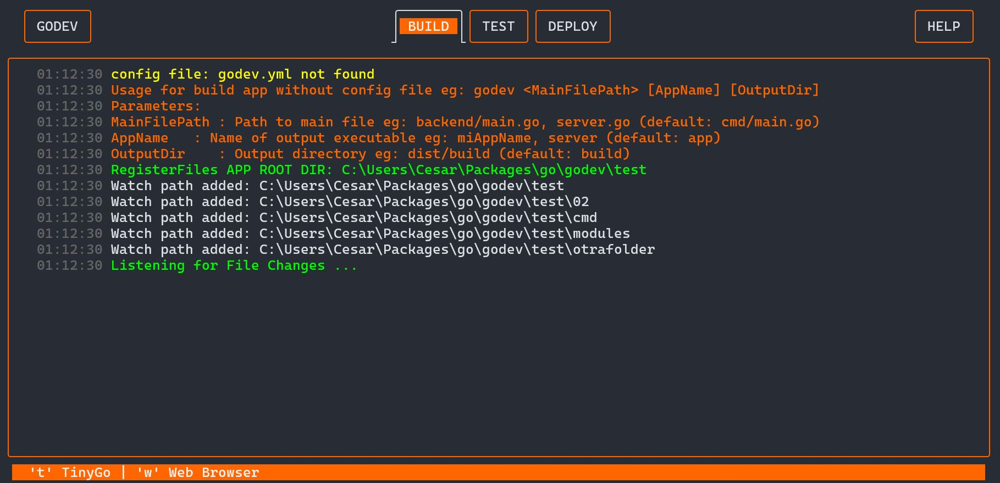

# TinyWasm
<!-- START_SECTION:BADGES_SECTION -->
<a href="docs/img/badges.svg"></a>
<!-- END_SECTION:BADGES_SECTION -->

**LLM-Friendly Full-Stack Go Framework** – Build complete web applications using **only Go + WebAssembly**, with minimal JavaScript. TinyWasm is a **TUI-based development environment** that acts as an intelligent intermediary between you, your LLM assistant, and your application.

⚠️ **Warning: Active Development**
This project is under active development, especially the TUI interface and MCP integration. Features may be unstable.



---

## 🎯 **Why TinyWasm?**

**TinyWasm is a TypeScript alternative for full-stack development—but with Go everywhere.**

Build production-ready web apps using **pure Go** for both backend and frontend, eliminating the complexity of modern JavaScript toolchains while maintaining type safety across your entire stack.

### **The Problem TinyWasm Solves**

Modern web development suffers from:
- **Configuration Hell**: Endless config files (`package.json`, `webpack.config.js`, `tsconfig.json`, etc.)
- **Tooling Complexity**: Multiple build tools, bundlers, transpilers, and package managers
- **Frontend/Backend Split**: Different languages, patterns, and ecosystems
- **LLM Context Waste**: Assistants spend tokens explaining infrastructure instead of building features

### **The TinyWasm Solution**

**Convention over Configuration** - Your project structure IS the configuration.
**Single Language** - Share code, types, and logic between client and server.
**Zero Dependencies** - Only Go standard library + minimal vanilla JS when absolutely necessary.
**LLM-Optimized** - The TUI handles all infrastructure, letting AI assistants focus on application code.

---

## ✨ **Key Features**

### 🤖 **LLM Integration via Model Context Protocol (MCP)**

TinyWasm includes a **fully functional Model Context Protocol server** that allows AI assistants (GitHub Copilot, Claude, etc.) to:
- 📸 **See your UI** - Capture screenshots and analyze the live browser state
- 📊 **Read logs** - Access WASM compilation, server, and browser console logs
- ⚙️ **Control compilation** - Switch between WASM modes (L/M/S) dynamically
- 🔄 **Manage environment** - Start/stop servers, reload browser, check status

**Why This Matters**: Your LLM can debug visual issues, optimize bundle sizes, and understand runtime behavior without you copy-pasting logs or screenshots. This **saves tokens and time**, making AI-assisted development dramatically more efficient.

The MCP server starts automatically when you run `tinywasm` and is available at `http://localhost:3030/mcp`.

### 📦 **Three WebAssembly Compilation Modes**

| Mode | Compiler | Size | Use Case |
|------|----------|------|----------|
| **L** (Large) | Go Standard | ~2MB | **Development** - Full standard library, all features, fastest iteration |
| **M** (Medium) | TinyGo (debug) | ~500KB | **Debugging** - Most features with debug symbols, balanced size/functionality |
| **S** (Small) | TinyGo (release) | ~200KB | **Production** - Minimal size, optimized for performance |

Switch modes on-the-fly via the TUI or let your LLM assistant choose based on context.

### 🔥 **Intelligent Hot Reload**

- **Backend**: Auto-compiles and restarts Go server on `.go` file changes
- **Frontend**: Auto-compiles WASM and reloads browser on `.go`, `.html`, `.css`, `.js` changes
- **Asset Pipeline**: Minifies CSS/JS automatically with cache busting
- **Smart Detection**: Watches only relevant files, ignores build artifacts

### 🖥️ **TUI Development Environment**

The TinyWasm TUI is your **development control center**:
- Real-time status of server, WASM compiler, asset watcher, and browser
- Color-coded logs from all components
- One-command setup: just run `tinywasm` in your project directory
- Chrome browser automation with live-reload injection
- HTTPS on port 6060 with dev certificates

**Philosophy**: The TUI manages infrastructure complexity so you (and your LLM) can focus on application logic.

### 🌐 **Pure Go Stack**

- **Backend**: Go standard library (no external frameworks required)
- **Frontend**: Go compiled to WebAssembly
- **JavaScript**: Only when strictly necessary (see "When to Use JavaScript" below)
- **No Transpiling**: No TypeScript, Babel, or JSX
- **No Bundlers**: TinyWasm handles asset optimization internally

---

## 🚀 **Installation**

### Prerequisites
- **Go 1.25.2+** - [Download from go.dev](https://go.dev/dl/)
- **TinyGo** (for M/S modes) - [Install TinyGo](https://tinygo.org/getting-started/install/)
- **Chrome/Chromium** - For browser automation

> **Future Vision**: TinyWasm will provide a standalone installer that bundles Go, Git, GitHub CLI, VS Code, and everything needed for development—no manual setup required.

### Install TinyWasm

```bash
# Verify Go version (must be >= 1.25.2)
go version

# Install TinyWasm CLI
go install -v github.com/tinywasm/app/cmd/tinywasm@latest

# Create your project directory
mkdir myapp && cd myapp

# Start TinyWasm (initializes project structure and TUI)
tinywasm
```

**That's it.** TinyWasm will:
1. Detect if it's a new project and scaffold the conventional structure
2. Start the development server on `http://localhost:6060`
3. Launch the TUI with live logs and status
4. Open Chrome with auto-reload enabled
5. Start the MCP server on `http://localhost:3030/mcp` for LLM integration

---

## 📁 [**Project Structure convention**](docs/PROJECT_STRUCTURE_EXAMPLE.md)


---

## 🧠 **When to Use JavaScript**

TinyWasm provides the basic WebAssembly bootstrap script automatically. You should **only write vanilla JavaScript when**:

1. **Performance-Critical Browser APIs** - When `syscall/js` overhead is too high (rare)
2. **Existing Vanilla Modules** - You have a working vanilla JS module not yet ported to Go
3. **No Go Alternative Yet** - APIs without a Go WASM wrapper

### **Go Ecosystem Growing**

TinyWasm is the **starting point** for a Go-first web ecosystem. Community contributions are encouraged, including:

- **[tinystring](https://github.com/tinywasm/fmt)** - 80% lighter alternative to `fmt`, `strconv`, `strings`, `bytes.Buffer`, and `errors`
- **localStorage / Service Workers** - Go ports coming soon
- **DOM Manipulation** - Pure Go (no JS needed)
- **More tools** - As the ecosystem grows

**Philosophy**: Use JavaScript only when **strictly necessary**. Everything else is Go.

---

## 🎯 **Who Should Use TinyWasm?**

### ✅ **Perfect For:**
- **Go Developers** wanting to build web frontends without learning React/Vue/TypeScript
- **TypeScript Refugees** seeking type safety without Node.js complexity
- **LLM-Assisted Development** - AI assistants can focus on code, not tooling
- **Full-Stack Code Reuse** - Share validation, business logic, and types across client/server
- **Performance-Conscious Teams** - WASM performance with tiny bundle sizes (200KB-2MB)
- **Solo Developers** - Zero configuration means faster time-to-market

### ❌ **Not For:**
- Projects requiring React, Vue, or Angular
- Teams deeply invested in the npm ecosystem
- Applications where frontend is primarily JavaScript/TypeScript (not Go)
- Complex frontend build pipelines (SASS, PostCSS, module federation, etc.)

---

## 🚧 **Future Vision**

TinyWasm aims to become a **complete Go web development platform**:

- **📦 One-Click Installer** - Bundles Go, TinyGo, Git, GitHub CLI, VS Code, and extensions
- **🌍 Edge Deployment** - First-class Cloudflare Workers support
- **🔧 Ecosystem Tools** - Community-driven Go libraries for web APIs
- **🤖 Enhanced LLM Integration** - Deeper MCP capabilities (test running, profiling, etc.)
- **📚 Starter Templates** - Pre-built full-stack apps (blogs, dashboards, SPAs)

---


## 📖 **Quick Start Example**

After running `tinywasm`, you'll have a working full-stack app. Here's what the default setup looks like:

### Backend (`web/server.go`)
```go
//go:build !wasm

package main

import (
    "fmt"
    "log"
    "net/http"
)

func main() {
    http.HandleFunc("/", func(w http.ResponseWriter, r *http.Request) {
        http.ServeFile(w, r, "web/public/index.html")
    })
    
    fmt.Println("Server running on http://localhost:6060")
    log.Fatal(http.ListenAndServe(":6060", nil))
}
```

### Frontend (`web/client.go`)
```go
//go:build wasm

package main

import "syscall/js"

func main() {
    document := js.Global().Get("document")
    body := document.Call("querySelector", "body")
    
    message := document.Call("createElement", "div")
    message.Set("innerHTML", "Hello, WebAssembly 👋 from GO")
    body.Call("appendChild", message)
    
    // Keep the program running
    select {}
}
```

### Shared Code (`web/shared.go`)
```go
package main

// This code works in both server and client
// No build tags = available everywhere

type User struct {
    Name  string
    Email string
}

func ValidateEmail(email string) bool {
    // Validation logic used by both client and server
    return len(email) > 0 && contains(email, "@")
}
```

**That's it!** Modify either file, and TinyWasm automatically:
1. Recompiles the changed component (backend or WASM)
2. Restarts the server (if backend changed)
3. Reloads the browser (if frontend or assets changed)

---

## 🤖 **LLM-Assisted Development Workflow**

TinyWasm is designed for **human + AI collaboration**:

### **Traditional Workflow** (Without TinyWasm)
```
Developer: "Add a user login form"
LLM: "First, let me explain the project structure...
      You need to configure webpack...
      Install these npm packages...
      Set up TypeScript...
      Configure babel..." 
      [500+ tokens wasted on setup context]
```

### **TinyWasm Workflow** (With MCP Integration)
```
Developer: "Add a user login form"
LLM: [Reads project via MCP] 
     [Sees current UI via screenshot]
     [Writes Go code in web/client.go]
     [Updates shared validation in web/shared.go]
     [TinyWasm auto-compiles and reloads]
     [LLM verifies UI via new screenshot]
Done. [10x faster, 5x fewer tokens]
```

**The TUI is the intermediary** - It handles all infrastructure so the LLM focuses on application logic.

---

## 📚 **Documentation**

- [**Project Structure Guide**](docs/PROJECT_STRUCTURE_EXAMPLE.md) - Detailed conventions
- [**MCP Integration**](docs/MCP.md) - LLM assistant setup and API reference
- [**WASM Modes**](docs/WASM_MODES.md) - When to use L/M/S (coming soon)
- [**Roadmap**](docs/ROADMAP.md) - Planned features

---

## 🤝 **Contributing**

TinyWasm welcomes contributions! We're building a **Go-first web ecosystem** and need:

- **Go Libraries** - Ports of browser APIs (localStorage, IndexedDB, etc.)
- **Performance Tools** - Benchmarks, profiling, bundle analysis
- **Templates** - Starter projects (blogs, dashboards, e-commerce)
- **Documentation** - Tutorials, examples, best practices
- **Bug Reports** - Help us improve stability

See [CONTRIBUTING.md](https://github.com/cdvelop/cdvelop/blob/main/CONTRIBUTING.md) for guidelines.

---

## 📄 **License**

MIT License - See [LICENSE](LICENSE) for details.

---

## 🙏 **Acknowledgments**

TinyWasm builds on amazing open-source projects:
- [**TinyGo**](https://tinygo.org/) - Small WASM binaries
- [**Go Team**](https://go.dev/) - World-class language and tooling
- **Model Context Protocol** - LLM integration standard

---

## 💬 **Support**

- **Issues**: [GitHub Issues](https://github.com/tinywasm/tinywasm/issues)
- **Discussions**: [GitHub Discussions](https://github.com/tinywasm/tinywasm/discussions)
- **Email**: [Your contact if available]

---

**Made with ❤️ by developers who hate configuration files.**

...