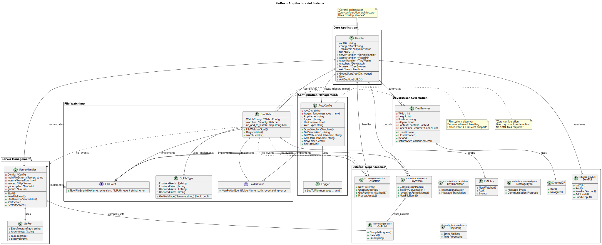
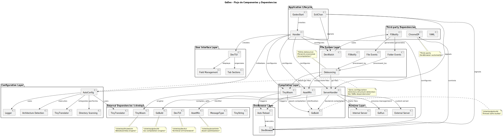

# GoDEV
<!-- START_SECTION:BADGES_SECTION -->
<a href="docs/img/badges.svg"></a>
<!-- END_SECTION:BADGES_SECTION -->

**Framework de desarrollo full stack con interfaz TUI** para aplicaciones web usando **solo Go estándar, HTML, CSS y JavaScript vanilla**. Elimina completamente los archivos de configuración usando **convenciones de estructura de directorios**.

⚠️ **Advertencia: Desarrollo en Progreso**
Este proyecto está actualmente en desarrollo activo, especialmente la interfaz TUI. Puede contener características inestables. NO USAR EN PRODUCCIÓN.


## Tabla de Contenidos
- [Motivación](#motivación)
- [Características](#características)
- [Instalación](#instalación)
  - [Prerrequisitos](#prerrequisitos)
  - [Instalación con go install](#instalación-con-go-install)
- [Uso](#uso)
- [Estructura del Proyecto](#estructura-del-proyecto)
- [Configuración](#configuración)
- [Hoja de ruta](#-hoja-de-ruta)
- [Agradecimientos](#prerrequisitos)
- [Contribuir](#contribuir)

## Motivación  

**GoDev** resuelve un problema específico: desarrollar aplicaciones web full stack usando **únicamente la librería estándar de Go** + HTML, CSS y JavaScript vanilla, sin archivos de configuración.

### 🎯 **Filosofía Cero Configuración**
- **Convenciones > Configuración**: La estructura de directorios ES la configuración
- **Solo Go estándar**: Sin dependencias externas complejas
- **No frameworks frontend**: Sin React, Vue, Angular - solo JavaScript vanilla
- **Estructura obligatoria**: Fuerza una estructura específica para eliminar configuraciones

### 🚫 **Lo que NO es GoDev**
- No es un bundler como Webpack/Vite (aunque empaqueta assets)
- No es compatible con frameworks frontend (React, Vue, etc.)  
- No requiere conocimiento de WebAssembly (se maneja automáticamente)
- No usa archivos de configuración (godev.yml ya no existe)

**Target**: Desarrolladores que aprenden Go o quieren simplicidad extrema sin configuraciones interminables.

## Características  

### 🏗️ **Framework por Convención**
- **Estructura obligatoria**: Los directorios definen el tipo de aplicación
- **Detección automática**: `cmd/`, `web/pwa/`, `web/spa/` detectados automáticamente  
- **Cero archivos de configuración**: No más `godev.yml`, `package.json`, `webpack.config.js`

### 🔥 **Hot Reload Inteligente**
- **Backend + Frontend**: Compila automáticamente Go estándar y WebAssembly
- **Archivos monitoreados**: `.go`, `.html`, `.css`, `.js`
- **Prefijos inteligentes**: `b.archivo.go` (backend), `f.archivo.go` (frontend)
- **Recarga automática**: Navegador se actualiza sin intervención manual

### 🌐 **Stack Tecnológico Simple**
- **Backend**: Solo librería estándar de Go
- **Frontend**: WebAssembly compilado desde Go + JavaScript vanilla
- **Assets**: CSS y JS vanilla minificados automáticamente
- **Sin transpiling**: No TypeScript, no SASS, no JSX

### 🖥️ **Interfaz TUI Minimalista**  
- **Ideal para VS Code**: Integración perfecta en terminal
- **Automatización del navegador**: Chrome controlado automáticamente (tecla `W`)
- **Puerto HTTPS**: 4430 con certificados de desarrollo

## Instalación

### 📦 **Instalación Actual (Requiere Go)**
```bash
# 1. Instalar Go desde https://go.dev/dl/
go version

# 2. Instalar GoDev
go install -v github.com/cdvelop/godev/cmd/godev@latest

# 3. Usar en cualquier proyecto
cd tu-proyecto-go
godev
```

### 🚀 **Instalación Futura (Planificada)**
**Instalador web automático** que detectará e instalará todo automáticamente:
- ✅ **Detección automática** de dependencias instaladas
- ✅ **Instalación automática** de faltantes: Go, Git, TinyGo, Docker, GitHub CLI  
- ✅ **Setup completo** con un solo comando
- ✅ **Sin conocimiento técnico** requerido

## Uso
```bash
# Navega a tu directorio de proyecto y ejecuta:
godev
```
**Eso es todo.** GoDev detecta automáticamente la estructura y configura todo.

GoDev detectará automáticamente la estructura de tu proyecto y configurará el entorno de desarrollo apropiado.


## Estructura del Proyecto

**⚠️ ESTRUCTURA OBLIGATORIA** - GoDev fuerza esta estructura para eliminar archivos de configuración:

### 📁 **Tipos de Aplicación Detectados**
- **`cmd/`**: Aplicación de consola (solo una permitida)
- **`pwa/`**: Progressive Web App  
- **`spa/`**: Single Page Application
- **`mpa/`**: Multi-Page Application
- **Combinaciones válidas**: `cmd + pwa`, `cmd + spa`, o `cmd + mpa`
- **Una sola arquitectura web**: Solo puede existir una arquitectura web (`pwa/` OR `spa/` OR `mpa/`)

### 🎯 **Prioridades de Arquitectura**
**Cuando múltiples arquitecturas web coexisten:**
- **PWA (Prioridad 1)**: Máxima prioridad
- **SPA (Prioridad 2)**: Segunda prioridad  
- **MPA (Prioridad 3)**: Tercera prioridad

### 🏷️ **Convención de Prefijos (OBLIGATORIA)**
**Dentro del directorio `modules/`:**
- **`b.archivo.go`**: Backend - Reinicia servidor y recarga navegador
- **`f.archivo.go`**: Frontend - Compila a WebAssembly y recarga navegador  
- **`archivo.go`**: Compartido - Reinicia servidor + WebAssembly + recarga navegador


### 📂 **Estructura del Proyecto**
```plaintext
AppName/                        # ⚠️ ESTRUCTURA OBLIGATORIA
├── cmd/                        # 📋 Aplicación de consola (opcional)
│   └── AppName/
│       └── main.go             # Punto de entrada CLI
│
├── modules/                    # 🔧 Lógica modular (obligatorio)
│   ├── modules.go              # Registro de módulos
│   │
│   ├── home/                   # 🏠 Módulo home con autenticación
│   │   ├── auth.go             # Estructuras y lógica de autenticación
│   │   ├── b.api.go            # 🔙 Backend API (// +build !wasm)
│   │   ├── f.auth.go           # 🌐 Frontend autenticación (// +build wasm)
│   │   └── handlers.go         # Handlers compartidos
│   │
│   ├── users/                  # 👥 Módulo de usuarios
│   │   ├── user.go             # Modelos de datos
│   │   ├── b.api.go            # 🔙 Backend API endpoints
│   │   ├── f.users.go          # 🌐 Frontend usuarios (// +build wasm)
│   │   └── f.events.go         # 🌐 Frontend eventos pub/sub
│   │
│   └── medical/                # 🏥 Módulo médico (ejemplo)
│       ├── patient.go          # Modelo de paciente
│       ├── b.api.go            # 🔙 Backend API
│       ├── f.medical.go        # 🌐 Frontend médico (// +build wasm)
│       └── handlers.go         # Handlers HTTP
│
├── pwa/                        # 📱 Progressive Web App (una de las 3)
│   ├── theme/                  # 🎨 Assets de desarrollo
│   │   ├── css/                # CSS sin procesar
│   │   └── js/                 # JavaScript sin procesar
│   │
│   ├── public/                 # � Assets finales (generados)
│   │   ├── img/                # Imágenes optimizadas
│   │   ├── icons.svg           # Sprite de iconos SVG
│   │   ├── main.js             # JavaScript minificado
│   │   ├── style.css           # CSS minificado
│   │   ├── AppName.wasm        # 🎯 WebAssembly compilado
│   │   ├── manifest.json       # Manifiesto PWA
│   │   ├── sw.js               # Service Worker
│   │   ├── icons/              # Iconos PWA
│   │   │   ├── icon-192x192.png
│   │   │   └── icon-512x512.png
│   │   ├── offline.html        # Página offline
│   │   └── index.html          # HTML principal generado
│   │
│   ├── main.server.go          # 🔙 Servidor Go (opcional)
│   └── main.wasm.go            # 🌐 Entry point WebAssembly (opcional)
│
├── spa/                        # 🌐 Single Page Application (alternativa)
│   ├── theme/                  # 🎨 Assets de desarrollo
│   ├── public/                 # 📁 Assets finales
│   ├── main.server.go          # 🔙 Servidor Go (opcional)
│   └── main.wasm.go            # 🌐 Entry point WebAssembly (opcional)
│
├── mpa/                        # 🌐 Multi-Page Application (alternativa)
│   ├── theme/                  # 🎨 Assets de desarrollo
│   ├── public/                 # 📁 Assets finales
│   ├── main.server.go          # 🔙 Servidor Go (opcional)
│   └── main.wasm.go            # 🌐 Entry point WebAssembly (opcional)
│
├── go.mod                      # 📦 Módulo Go
├── env                         # 🔧 Variables de entorno
└── .gitignore                  # 📋 Archivos ignorados por git
```

### 🎯 **Convenciones de Nomenclatura**
| Prefijo | Tipo | Propósito | Build Tag |
|---------|------|-----------|-----------|
| `b.` | Backend | API, servidor, base de datos | `// +build !wasm` |
| `f.` | Frontend | UI, eventos, interacciones | `// +build wasm` |
| `*.go` | Compartido | Modelos, utilidades, tipos | Sin build tag |

### 📁 **Detección Automática**
- **`cmd/`** presente → Aplicación híbrida (CLI + Web)
- **`pwa/`** presente → Progressive Web App  
- **`spa/`** presente → Single Page Application
- **`mpa/`** presente → Multi-Page Application
- **Múltiples arquitecturas** → Aplica orden de prioridad (PWA > SPA > MPA)
- **Ninguna arquitectura** → Retorna `unknown` (manejador central decide)


## Configuración

### ✅ **Cero Configuración**
- **No hay archivos de configuración**: `godev.yml` eliminado completamente
- **Estructura = Configuración**: Los directorios definen el comportamiento
- **Puerto fijo**: 4430 (HTTPS) para desarrollo local
- **Detección automática**: Tipo de aplicación detectado por estructura de carpetas

### 🎯 **Convenciones Obligatorias**
| Directorio | Propósito | Archivos Opcionales |
|------------|-----------|-------------------|
| `cmd/AppName/` | Aplicación consola | `main.go` |
| `pwa/` | Progressive Web App | `main.server.go`, `main.wasm.go` |
| `spa/` | Single Page App | `main.server.go`, `main.wasm.go` |
| `mpa/` | Multi-Page App | `main.server.go`, `main.wasm.go` |
| `modules/` | Lógica modular | `b.*.go`, `f.*.go` |

**Reglas de Arquitectura:**
- ✅ **Una sola arquitectura web** permitida por proyecto
- ✅ **Prioridad automática**: PWA(1) > SPA(2) > MPA(3)  
- ✅ **Aplicación híbrida**: `cmd/` + cualquier arquitectura web
- ❌ **No múltiples**: `pwa/` + `spa/` (se aplica prioridad con warning)

## 📌 Hoja de Ruta

### ✅ MVP (Versión Mínima Viable)  
### Frontend
- [x] Unificación y minificación de archivos CSS y JavaScript 
- [ ] cargar assets del directorio `web/theme` primero (assets handler)
- [ ] Generación automática de `web/public/index.html` si este no existe  
- [ ] Compilar iconos svg módulos en sprite único en `web/public/icons.svg`

### Servidor de Desarrollo
- [ ] Servidor de desarrollo integrado para servir archivos estáticos en `web/public`
- [ ] https integrado en desarrollo local
- [x] cerrar navegador al cerrar aplicación 
- [x] Ejecución navegador Chrome (tecla `w`)  
- [x] cambiar el tamaño de la ventana del navegador desde la tui

### Hot Reload
- [x] Detección de cambios en archivos HTML, CSS, y JS  
- [x] detección de cambios en archivos GO frontend para webAssembly y servidor backend
- [ ] detectar cambios en archivos SVG
- [ ] Recarga en caliente del navegador (Hot Reload)

### Backend
- [x] Detección de cambios en archivos del servidor  
- [ ] Reinicio automático si hay modificaciones  

### Configuración
- [x] Interfaz TUI minimalista para VS Code  
- [x] **Detección automática por estructura de directorios** ✅
- [x] **Eliminación completa de archivos de configuración** ✅
- [ ] Finalizar especificación de interacción TUI
- [ ] Agregar .gitignore automático


### 🚀 Mejoras Futuras  
- [ ] **Completar especificación TUI** para interacción final
- [ ] Modo producción: Artefactos optimizados y deploy
- [ ] Compatibilidad con servidores VPS
- [ ] Compatibilidad con Docker  
- [ ] Integrar ayudante IA

## 🎯 **¿Para Quién es GoDev?**

### ✅ **Ideal Para:**
- Desarrolladores aprendiendo Go que quieren hacer web
- Proyectos que necesitan simplicidad extrema  
- Equipos que odian configuraciones complejas
- Desarrollo con solo Go estándar + HTML/CSS/JS vanilla

### ❌ **NO es Para:**
- Proyectos con React, Vue, Angular
- Aplicaciones que requieren transpilación compleja
- Desarrollo con múltiples frameworks frontend
- Proyectos que necesitan configuración granular


## Arquitectura


## Flujo de Componentes



## Agradecimientos
Este proyecto no sería posible sin:
- github.com/fsnotify
- github.com/chromedp
- github.com/tdewolff/minify
- github.com/fstanis/screenresolution

Para problemas o soporte, por favor visita [GitHub Issues](https://github.com/cdvelop/godev/issues).

## Participar
si quieres participar en el proyecto puedes contactarme con un mensaje privado 


## Contribuir

Si encuentras útil este proyecto y te gustaría apoyarlo, puedes hacer una donación [aquí con paypal](https://paypal.me/cdvelop?country.x=CL&locale.x=es_XC)

