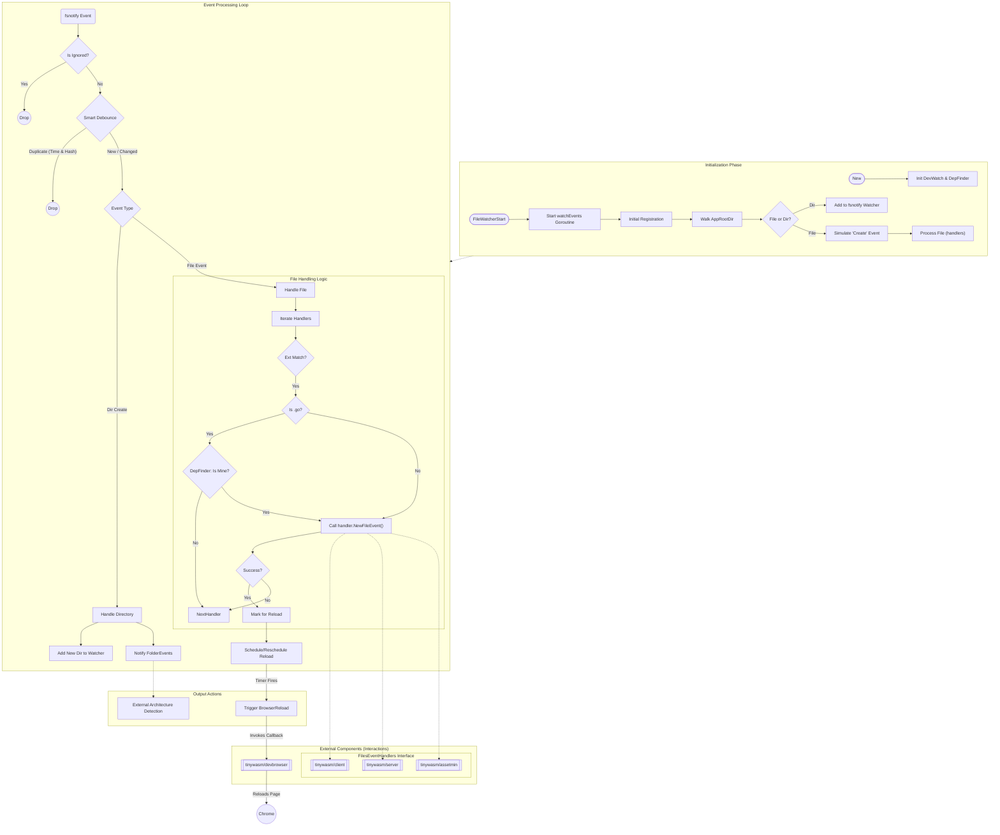

# TinyWasm DevWatch Flow

This diagram illustrates the internal processing of `tinywasm/devwatch` and its interactions with other system components (`client`, `server`, `assetmin`, `devbrowser`) as configured in `section-build.go`.

