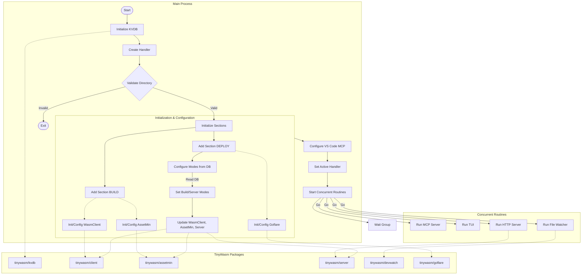

# TinyWasm App Startup Flow

This diagram illustrates how `tinywasm/app` initializes and orchestrates different components during startup, as defined in `start.go`.

```mermaid
flowchart TD
    subgraph Main_Process [Main Process]
        Start([Start]) --> InitDB[Initialize KVDB]
        InitDB --> CreateHandler[Create Handler]
        CreateHandler --> ValidateDir{Validate Directory}
        
        ValidateDir -- Valid --> InitSections[Initialize Sections]
        ValidateDir -- Invalid --> Exit([Exit])

        subgraph Initialization [Initialization & Configuration]
            InitSections --> AddBuild[Add Section BUILD]
            InitSections --> AddDeploy[Add Section DEPLOY]
            
            AddBuild -.-> InitClient[Init/Config WasmClient]
            AddBuild -.-> InitAssetMin[Init/Config AssetMin]
            AddDeploy -.-> InitGoflare[Init/Config Goflare]

            AddDeploy --> ConfigModes[Configure Modes from DB]
            ConfigModes -- Read DB --> SetModeLocal[Set Build/Server Modes]
            SetModeLocal --> UpdateDeps[Update WasmClient, AssetMin, Server]
        end

        Initialization --> ConfigMCP[Configure VS Code MCP]
        ConfigMCP --> SetActive[Set Active Handler]
        SetActive --> StartConcurrency[Start Concurrent Routines]
    end

    subgraph Concurrent_Routines [Concurrent Routines]
        direction TB
        StartConcurrency -->|Go| RunMCP[Run MCP Server]
        StartConcurrency -->|Go| RunTUI[Run TUI]
        StartConcurrency -->|Go| RunServer[Run HTTP Server]
        StartConcurrency -->|Go| RunWatcher[Run File Watcher]
    end

    subgraph Packages [TinyWasm Packages]
        direction LR
        PkgKVDB[tinywasm/kvdb]
        PkgClient[tinywasm/client]
        PkgAssetMin[tinywasm/assetmin]
        PkgServer[tinywasm/server]
        PkgDevWatch[tinywasm/devwatch]
        PkgGoflare[tinywasm/goflare]
    end

    %% Relationships to Packages
    InitDB -.-> PkgKVDB
    InitClient -.-> PkgClient
    InitAssetMin -.-> PkgAssetMin
    RunServer -.-> PkgServer
    RunWatcher -.-> PkgDevWatch
    InitGoflare -.-> PkgGoflare
    UpdateDeps -.-> PkgClient
    UpdateDeps -.-> PkgAssetMin
    UpdateDeps -.-> PkgServer

    StartConcurrency --> Wait[Wait Group]
```
