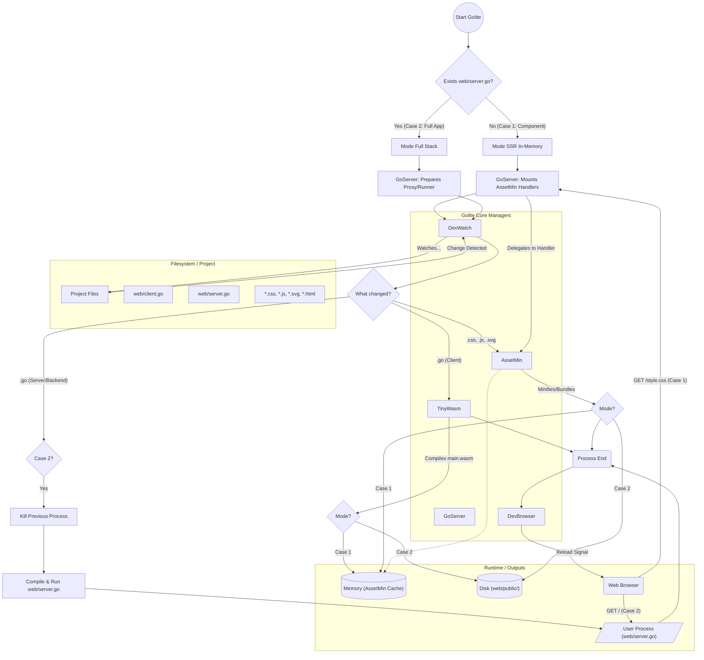

# GoLite Architecture & Flow

This document outlines the internal architecture, component interaction, and data flow of the GoLite framework.

## Overview

GoLite acts as an intelligent orchestrator and build system that manages the lifecycle of a Go-based web application. It integrates several specialized managers to handle asset processing, compilation, server management, and browser automation.

## Core Components

*   **Golite (Orchestrator)**: The main entry point that initializes and coordinates all other components.
*   **DevWatch (Vigilante)**: Monitors the file system for changes. It uses `depfind` to intelligently determine which files affect the build and notifies the appropriate managers.
*   **AssetMin (Asset Manager)**: Handles the processing of static assets (`.css`, `.js`, `.svg`, `.html`).
    *   **In-Memory Mode**: Minifies and serves assets directly from memory (used in Component/SSR mode).
    *   **Disk Mode**: Writes processed assets to `web/public/` (used in Full App mode).
*   **TinyWasm (Compiler)**: Compiles `web/client.go` into WebAssembly (`web/public/main.wasm`).
*   **GoServer (Web Server)**: Serves the application.
    *   Can act as a static file server or a reverse proxy/runner for the user's backend code.
*   **DevBrowser (Browser Controller)**: Manages the Chrome/Chromium instance, handling initialization and live reloading.

## Operational Modes

GoLite automatically detects the mode of operation based on the project structure:

1.  **Component Mode (SSR/In-Memory)**
    *   **Trigger**: No `web/server.go` exists.
    *   **Behavior**: `AssetMin` does not write to disk. `GoServer` mounts `AssetMin`'s handlers directly to serve assets from memory. This mode is optimized for developing individual components or static sites.

2.  **Full App Mode (Client/Server)**
    *   **Trigger**: `web/server.go` exists.
    *   **Behavior**: `AssetMin` writes processed assets to `web/public/`. `GoServer` manages the user's backend process (`web/server.go`), restarting it whenever backend code changes.

## Flow Diagram

The following diagram illustrates the event loop and interaction between components:

## Detailed Workflow

1.  **Initialization**:
    *   Golite checks for `web/server.go`.
    *   **Case 1**: `GoServer` is configured to use `AssetMin`'s HTTP handlers directly.
    *   **Case 2**: `GoServer` prepares to manage the user's server process.

2.  **Change Detection**:
    *   `DevWatch` detects file changes and classifies them by extension.

3.  **Sequential Processing**:
    *   **Frontend Code (`.go`)**: `TinyWasm` compiles the code. The output goes to memory (Case 1) or disk (Case 2).
    *   **Assets (`.css`, `.js`, etc.)**: `AssetMin` processes them. It updates its internal cache or writes to disk. Note that `AssetMin` does *not* notify `GoServer` directly; `GoServer` either serves the updated content via the handler (Case 1) or the user server serves the file from disk (Case 2).
    *   **Backend Code (`.go`)**: If in Case 2, the running user process is killed, recompiled, and restarted.

4.  **Reload**:
    *   Once all processing steps are complete, `DevBrowser` receives a signal to reload the browser page, ensuring the user always sees the latest version of the application.
