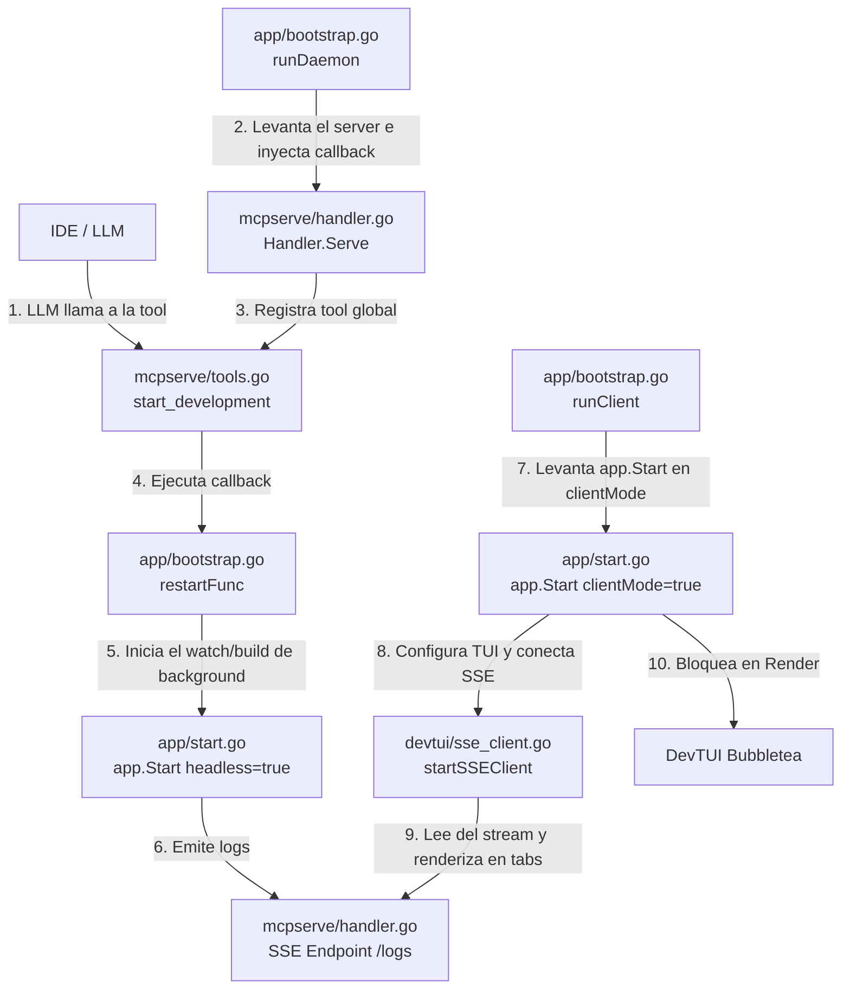

# Completion of MCP Daemon and TUI Client Refactor

The recent refactoring separating the MCP Daemon and the project watcher/server (`app`) was incomplete. Based on your clarification, `devtui` is just a UI layer, and `app.Start` must be responsible for injecting the tabs even in Client mode.

## User Review Required
Please review the updated architecture diagram and proposed changes.

## Diagrama de Arquitectura de la Solución (Cómo interactúan los cambios)

## Proposed Changes (Ubicación exacta del código)

### 1. [MODIFY] [app/bootstrap.go](file:///home/cesar/Dev/Project/tinywasm/app/bootstrap.go)
- **Dónde:** En [runDaemon](file:///home/cesar/Dev/Project/tinywasm/app/bootstrap.go#77-112).
- **Qué:** Eliminar el bucle `for { Start(...) }`. En su lugar, inicializar el `mcpserve.Handler` global, configurar [SetProjectRestartFunc](file:///home/cesar/Dev/Project/tinywasm/mcpserve/handler.go#88-92), y llamar a `h.MCP.Serve()` bloqueando el hilo. La función que pasemos a [SetProjectRestartFunc](file:///home/cesar/Dev/Project/tinywasm/mcpserve/handler.go#88-92) es la que ejecutará el `app.Start` headless pasándole la nueva ruta (y gestionando la cancelación del viejo proyecto).
- **Dónde 2:** En [runClient](file:///home/cesar/Dev/Project/tinywasm/app/bootstrap.go#113-150).
- **Qué 2:** En lugar de crear la UI y quedarse escuchando manualmente SSE con `bufio`, [runClient](file:///home/cesar/Dev/Project/tinywasm/app/bootstrap.go#113-150) llamará a `app.Start(..., clientMode=true)` para que `app` orqueste todo.

### 2. [MODIFY] [app/start.go](file:///home/cesar/Dev/Project/tinywasm/app/start.go)
- **Dónde:** En la firma de [Start()](file:///home/cesar/Dev/Project/tinywasm/devtui/init.go#149-181) y su cuerpo.
- **Qué:** Modificar la firma (o pasar una estructura de opciones) para admitir `clientMode bool`.
- **Qué 2:** Si `clientMode == true`, [Start](file:///home/cesar/Dev/Project/tinywasm/devtui/init.go#149-181) llamará a [AddSectionBUILD()](file:///home/cesar/Dev/Project/tinywasm/app/section-build.go#11-24) y `AddSectionDEPLOY()` (para que `devtui` reciba la configuración de las pestañas), pero luego haremos un retorno temprano (o un bypass) de [InitBuildHandlers](file:///home/cesar/Dev/Project/tinywasm/app/section-build.go#25-192), Watcher, DB y el arranque de rutinas de compilación. En su lugar, el cliente delegará a `tui.StartSSEClient` y luego llamará a `h.Tui.Start()` sin arrancar backends locales.

### 3. [MODIFY] [mcpserve/handler.go](file:///home/cesar/Dev/Project/tinywasm/mcpserve/handler.go)
- **Dónde:** En todo el archivo.
- **Qué:** Se eliminó por completo `StartProject`, `StopProject`, `SetProjectRestartFunc` y `context` de proyectos. El servidor MCP ahora es puramente agnóstico y delega toda la lógica de negocio.
- **Qué 2:** Se implementó `OnUIAction` como webhook genérico HTTP `POST /action` para que BubbleTea delegue `q` o `r` al orquestador principal sin que `mcpserve` entienda el significado.

### 4. [MODIFY] [app/mcp-tools.go](file:///home/cesar/Dev/Project/tinywasm/app/mcp-tools.go)
- **Dónde:** En `GetMCPToolsMetadata`.
- **Qué:** La herramienta `start_development` ya no se expone aquí. Pasó a ser propiedad y responsabilidad de un provider residente en `app/bootstrap.go`.

### 5. [MODIFY] [app/bootstrap.go](file:///home/cesar/Dev/Project/tinywasm/app/bootstrap.go)
- **Dónde:** En `runDaemon`.
- **Qué:** Se creó el struct `daemonToolProvider` que respeta la interfaz `mcpserve.ToolProvider`.
- **Qué 2:** Este provider es quien registra `start_development` al `mcpserve` global, reteniendo el control del ciclo de vida de los proyectos. Él lanza una goroutine con `runProjectLoop` que levanta `app.Start` headless, y es quien mata el contexto `ctx` cuando se llama a arrancar un proyecto nuevo remotamente.
