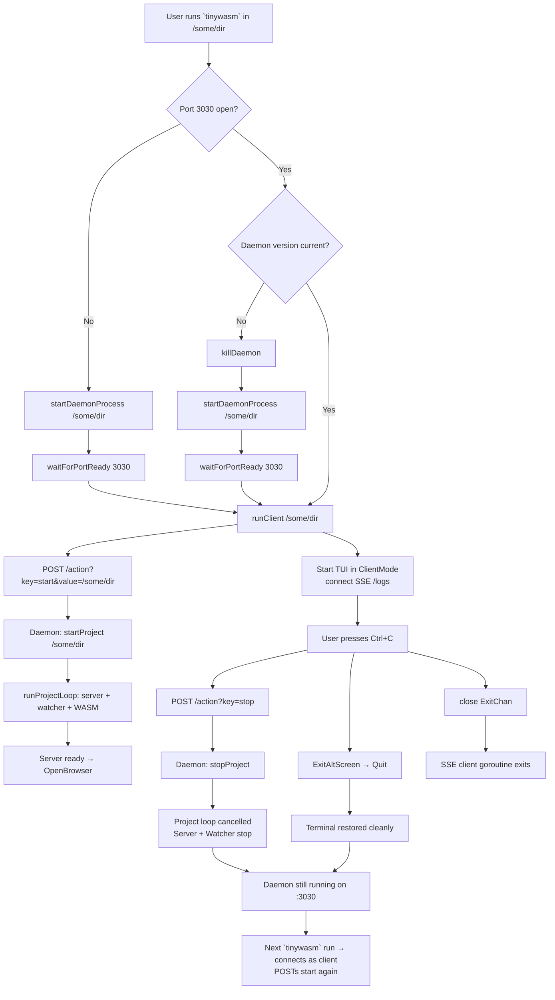

# Client Lifecycle: `tinywasm` Invocation Flow

## Key Invariants

| Invariant | Test |
|-----------|------|
| Every `tinywasm` invocation POSTs `start` with cwd to daemon | `TestRunClient_PostsStartAction` |
| Ctrl+C sends `stop` to daemon before closing TUI | `TestClientMode_CtrlC_SendsStop` |
| Ctrl+C exits alt-screen before quit (terminal cleaned) | `TestCtrlC_ExitsAltScreen` |
| Daemon `start` action calls `startProject(value)` | `TestDaemon_StartAction_StartsProject` |
| Daemon `stop` action calls `stopProject()` | `TestDaemon_StopAction_StopsProject` |
| Daemon survives client disconnect | (integration, not automated) |
