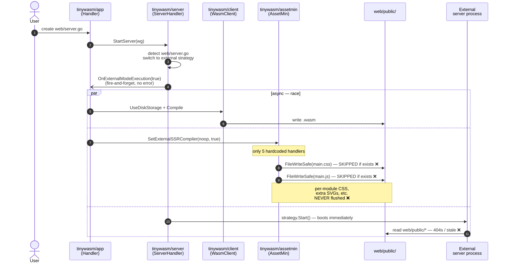
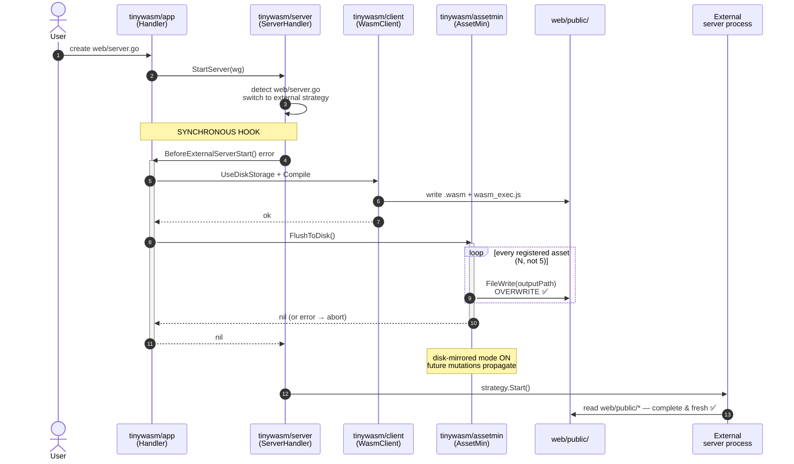
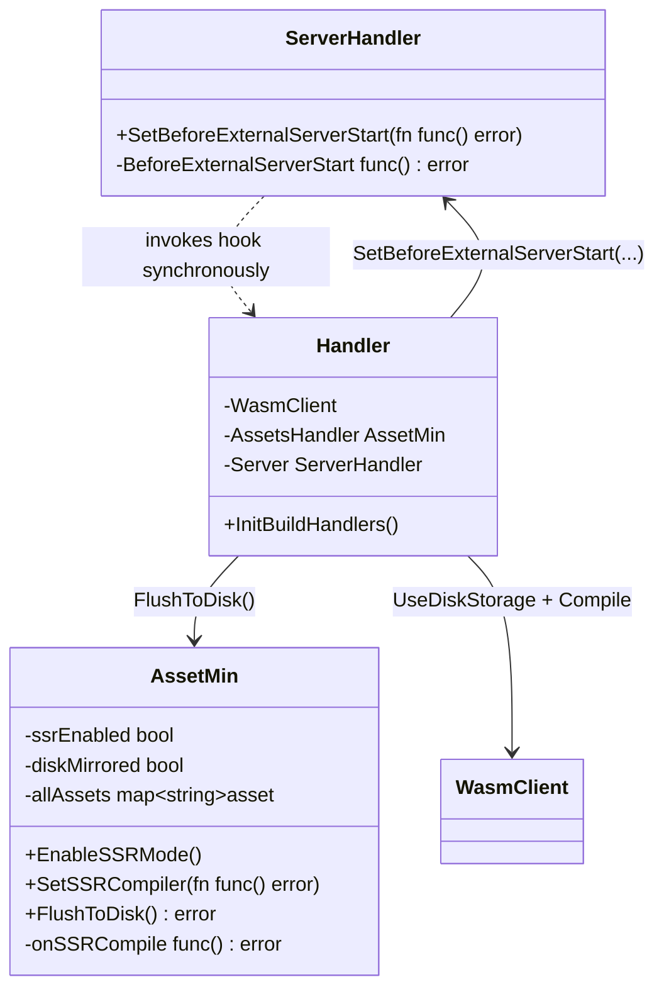

# External server mode transition — flow

Companion to [app/docs/PLAN.md](../PLAN.md) and
[assetmin/docs/PLAN.md](../../../assetmin/docs/PLAN.md).

## Current (buggy) flow

Defects highlighted (❌):
- **B1** `FileWriteSafe` skips stale files → in-memory bytes lost.
- **B2** Only 5 main handlers enumerated → module assets never reach disk.
- **B2 (race)** `strategy.Start` runs in parallel with the flush.

## Expected (post-fix) flow

Guarantees:
- ✅ `BeforeExternalServerStart` returns BEFORE `strategy.Start` is called.
- ✅ Every in-memory asset is on disk (overwritten, not skipped).
- ✅ A non-nil error from the hook aborts the transition with a logged message;
  `strategy.Start` is never invoked.
- ✅ After flush, `assetmin` mirrors subsequent in-memory mutations to disk.

## Component contracts (post-fix)

## Removed APIs (no shims)

| Package   | Removed                                          | Replaced by                                  |
|-----------|--------------------------------------------------|----------------------------------------------|
| client    | `SetBuildOnDisk(onDisk, compileNow bool)`        | `UseDiskStorage()` + `UseMemoryStorage()` + explicit `Compile()` |
| assetmin  | `SetExternalSSRCompiler(fn, bool)`               | `EnableSSRMode()` + `SetSSRCompiler(fn)` + `FlushToDisk()` |
| assetmin  | `SetBuildOnDisk(bool)` (deprecated alias)        | `FlushToDisk()`                              |
| assetmin  | `isSSRMode = (onSSRCompile != nil)`              | `c.ssrEnabled` set by `EnableSSRMode`        |
| assetmin  | compiler auto-invoked on registration            | `SetSSRCompiler` is a pure setter            |
| assetmin  | `FileWriteSafe(...)`                             | `FileWrite(...)` (overwrite is correct)      |
| assetmin  | `buildOnDisk` field                              | `diskMirrored` internal flag (set by flush)  |
| server    | `OnExternalModeExecution(isExternal bool)`       | `BeforeExternalServerStart() error`          |
| server    | `SetOnExternalModeExecution(fn)`                 | `SetBeforeExternalServerStart(fn)`           |
