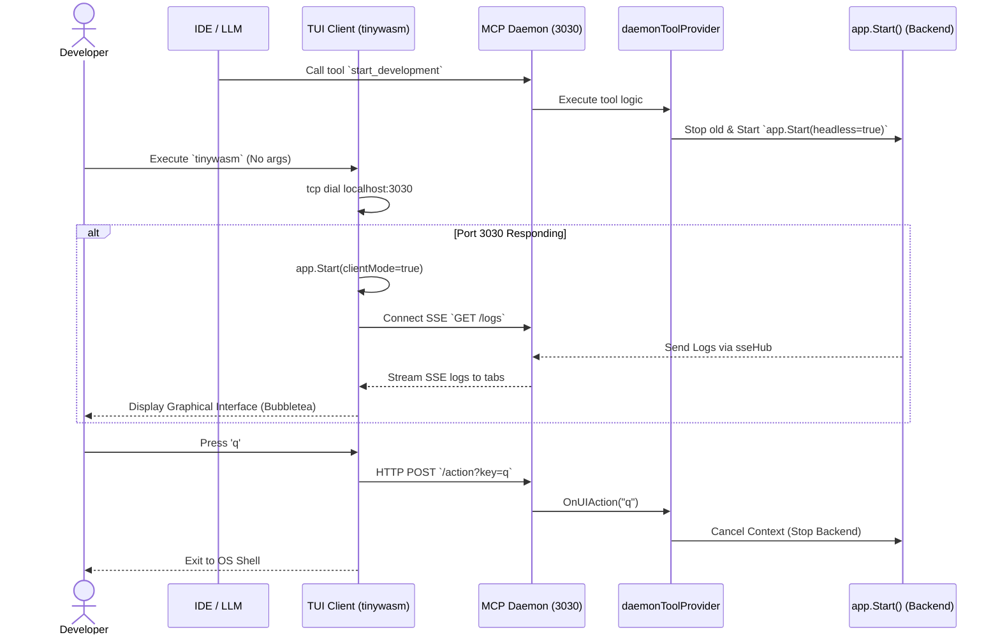

```mermaid
sequenceDiagram
    actor Dev as Developer
    participant IDE as IDE / LLM
    participant Cmd as TUI Client (tinywasm)
    participant MCP as MCP Daemon (3030)
    participant Provider as daemonToolProvider
    participant App as app.Start() (Backend)

    IDE->>MCP: Call tool `start_development`
    MCP->>Provider: Execute tool logic
    Provider->>App: Stop old & Start `app.Start(headless=true)`
    
    Dev->>Cmd: Execute `tinywasm` (No args)
    Cmd->>Cmd: tcp dial localhost:3030
    alt Port 3030 Responding
        Cmd->>Cmd: app.Start(clientMode=true)
        Cmd->>MCP: Connect SSE `GET /logs`
        App-->>MCP: Send Logs via sseHub
        MCP-->>Cmd: Stream SSE logs to tabs
        Cmd-->>Dev: Display Graphical Interface (Bubbletea)
    end
    
    Dev->>Cmd: Press 'q'
    Cmd->>MCP: HTTP POST `/action?key=q`
    MCP->>Provider: OnUIAction("q")
    Provider->>App: Cancel Context (Stop Backend)
    Cmd-->>Dev: Exit to OS Shell
```
