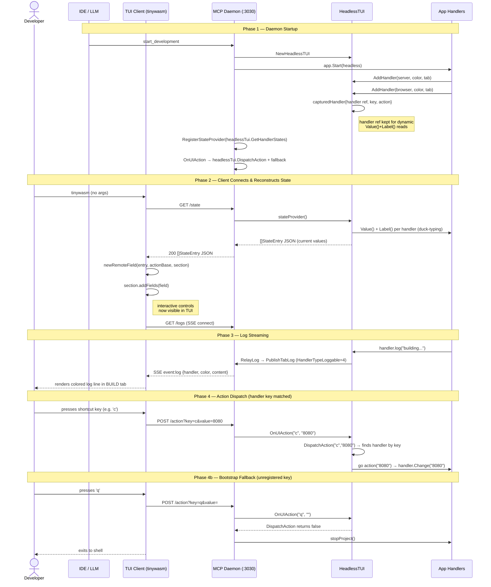

# MCP Refactor — Data Flow (Sequence Diagram)

```mermaid
sequenceDiagram
    actor Dev as Developer
    participant IDE as IDE / LLM
    participant DevTUI as TUI Client (tinywasm)
    participant MCP as MCP Daemon (:3030)
    participant Headless as HeadlessTUI
    participant App as App Handlers

    Note over IDE,App: Phase 1 — Daemon Startup
    IDE->>MCP: start_development
    MCP->>Headless: NewHeadlessTUI
    MCP->>App: app.Start(headless)
    App->>Headless: AddHandler(server, color, tab)
    App->>Headless: AddHandler(browser, color, tab)
    Headless->>Headless: capturedHandler{handler ref, key, action}
    Note right of Headless: handler ref kept for dynamic<br/>Value()+Label() reads
    MCP->>MCP: RegisterStateProvider(headlessTui.GetHandlerStates)
    MCP->>MCP: OnUIAction → headlessTui.DispatchAction + fallback

    Note over Dev,App: Phase 2 — Client Connects & Reconstructs State
    Dev->>DevTUI: tinywasm (no args)
    DevTUI->>MCP: GET /state
    MCP->>Headless: stateProvider()
    Headless->>App: Value() + Label() per handler (duck-typing)
    Headless-->>MCP: []StateEntry JSON (current values)
    MCP-->>DevTUI: 200 []StateEntry JSON
    DevTUI->>DevTUI: newRemoteField(entry, actionBase, section)
    DevTUI->>DevTUI: section.addFields(field)
    Note right of DevTUI: interactive controls<br/>now visible in TUI
    DevTUI->>MCP: GET /logs (SSE connect)

    Note over Dev,App: Phase 3 — Log Streaming
    App->>Headless: handler.log("building...")
    Headless->>MCP: RelayLog → PublishTabLog (HandlerTypeLoggable=4)
    MCP-->>DevTUI: SSE event:log {handler, color, content}
    DevTUI-->>Dev: renders colored log line in BUILD tab

    Note over Dev,App: Phase 4 — Action Dispatch (handler key matched)
    Dev->>DevTUI: presses shortcut key (e.g. 'c')
    DevTUI->>MCP: POST /action?key=c&value=8080
    MCP->>Headless: OnUIAction("c", "8080")
    Headless->>Headless: DispatchAction("c","8080") → finds handler by key
    Headless->>App: go action("8080") → handler.Change("8080")

    Note over Dev,App: Phase 4b — Bootstrap Fallback (unregistered key)
    Dev->>DevTUI: presses 'q'
    DevTUI->>MCP: POST /action?key=q&value=
    MCP->>Headless: OnUIAction("q", "")
    Headless-->>MCP: DispatchAction returns false
    MCP->>App: stopProject()
    DevTUI-->>Dev: exits to shell
```
