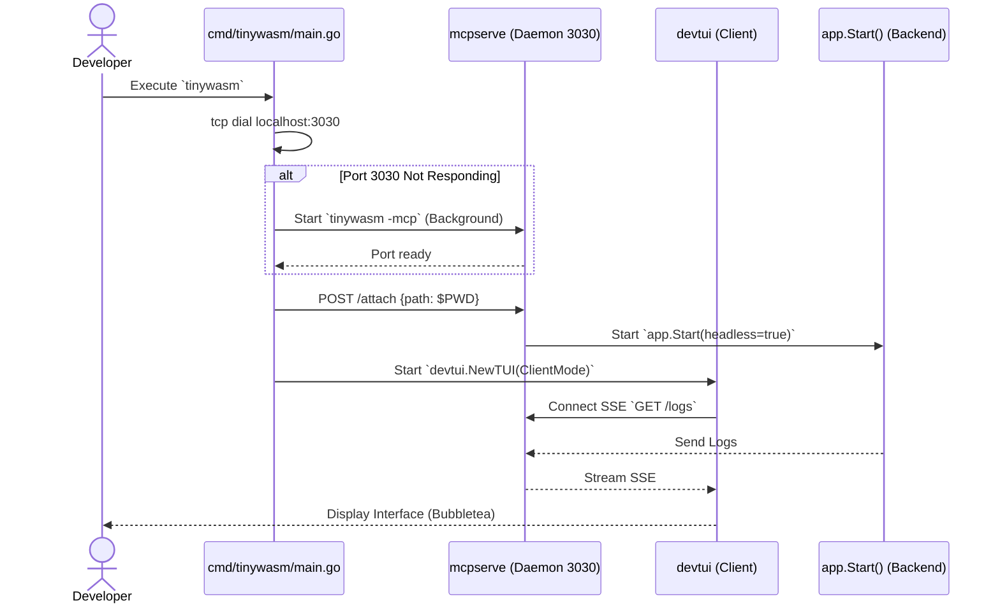

```mermaid
sequenceDiagram
    actor Dev as Developer
    participant Cmd as cmd/tinywasm/main.go
    participant MCP as mcpserve (Daemon 3030)
    participant TUI as devtui (Client)
    participant App as app.Start() (Backend)

    Dev->>Cmd: Execute `tinywasm`
    Cmd->>Cmd: tcp dial localhost:3030
    alt Port 3030 Not Responding
        Cmd->>MCP: Start `tinywasm -mcp` (Background)
        MCP-->>Cmd: Port ready
    end
    Cmd->>MCP: POST /attach {path: $PWD}
    MCP->>App: Start `app.Start(headless=true)`
    Cmd->>TUI: Start `devtui.NewTUI(ClientMode)`
    TUI->>MCP: Connect SSE `GET /logs`
    App-->>MCP: Send Logs
    MCP-->>TUI: Stream SSE
    TUI-->>Dev: Display Interface (Bubbletea)
```
