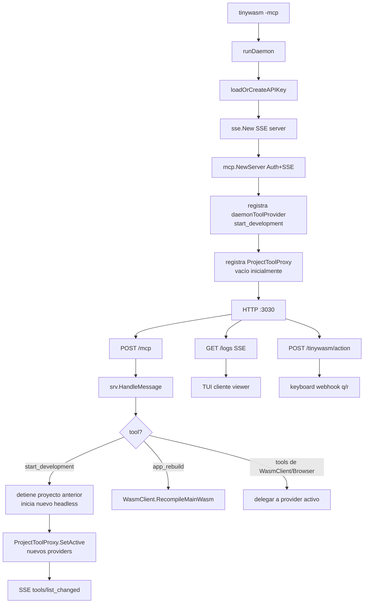

# MCP Daemon Flow

```mermaid
flowchart TD
    A[tinywasm -mcp] --> B[runDaemon]
    B --> C[loadOrCreateAPIKey]
    C --> D[sse.New SSE server]
    D --> E[mcp.NewServer Auth+SSE]
    E --> F[registra daemonToolProvider<br/>start_development]
    F --> G[registra ProjectToolProxy<br/>vacío inicialmente]
    G --> H[HTTP :3030]
    H --> I[POST /mcp]
    H --> J[GET /logs SSE]
    H --> K[POST /tinywasm/action]
    I --> L[srv.HandleMessage]
    L --> M{tool?}
    M -->|start_development| N[detiene proyecto anterior<br/>inicia nuevo headless]
    N --> O[ProjectToolProxy.SetActive<br/>nuevos providers]
    O --> P[SSE tools/list_changed]
    M -->|app_rebuild| Q[WasmClient.RecompileMainWasm]
    M -->|tools de WasmClient/Browser| R[delegar a provider activo]
    J --> S[TUI cliente viewer]
    K --> T[keyboard webhook q/r]
```
